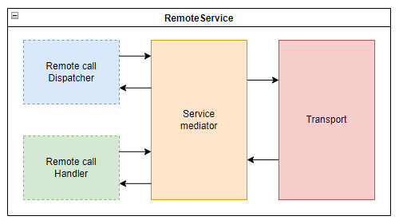

# LiteWare.Remoting.Core for .NET

[](https://www.nuget.org/packages/LiteWare.Remoting.Core)
[](https://github.com/samsam07/LiteWare.Remoting.Core-dotnet/blob/master/LICENSE)

LiteWare's core implementation for distributed systems.
It provides the barebone communication framework that handles the flow of data between connected distributed systems.

Built with flexibility and extensibility in mind, the core framework was designed to provide many abstractions to allow customizations in implementing libraries.
For instance, you can create a custom transport (HTTP, IPC or whatever protocol) to transport payload between remote services.

## Infrastructure overview

The framework uses the `RemoteService` class for all communications.
It is the main service of the framework and is broken down into 4 sub-systems:



1. The transport (a.k.a `RemoteTransport`)  
   It is responsible for serialization and sending/receiving of payloads over a transport/network.

2. The service mediator  
   It is responsible for payload marshalling and its distribution across the other sub-systems.

3. The optionally configured Remote call Dispatcher (a.k.a `RemoteCallDispatcher`)  
   It is responsible for invoking remote calls on other remote services.  
   This sub-system is optional and can be omitted during configuration. This will prevent the service from invoking remote calls.

4. The optionally configured Remote call Handler (a.k.a `RemoteCallHandler`)  
   It is responsible for the handling of incoming remote calls and to create response to these incoming calls.  
   This sub-system is optional and can be omitted during configuration. This will prevent the service from handling remote calls.

## Implementing the core library

Any library implementing LiteWare.Remoting.Core should implement the following:

### 1. Custom marshaller (`IMarshaller`)

The `RemoteService` requires an implementation of `IMarshaller` to convert remote calls and requests to and from an array of bytes.

### 2. Custom transport (`RemoteTransport`, `IMessageSerializer` and `RemoteTransportBuilder`)

The transport is represented by the abstract `RemoteTransport` class and is responsible for the exchange of payloads between remote services.
This class should be extended and specialized to use a specific communication protocol.

The `RemoteTransport` is also responsible for the serialization and deserialization of payloads and thus,requires that an implementation of `IMessageSerializer` is provided during its construction.
`IMessageSerializer` is different from `IMarshaller`. The latter serializes remote objects (`RemoteCall` and `RemoteResponse`) while the former serializes framed payloads (`Message`) containing remote objects.

Implementations of the `RemoteTransport` class should prevent direct initialization through constructors.
A derivation of the `RemoteTransportBuilder` class should instead be used to build new instances as this allows for a proper configuration of the transport in a remote service.

### 3. Custom command invoking

An implementation of `ICommandInvoker` must be provided if a `RemoteService` is configured to handle incoming remote calls.
The `ICommandInvoker` is tasked with interpreting the remote call to generate a response.

## Using `RemoteService`

`RemoteService` is the main class that allows remoting on distributed systems. It can be configured in 3 ways:

1. It can be configured to *handle* incoming remote calls  
   This will automatically create and send responses when needed. This process can be configured to be synchronous or asynchronous.

2. It can also be configured to *dispatch* remote calls, allowing the following code to be executed:

   ``` csharp
   remoteService.Call("IncrementCounter"); // Make a one-way call to a remote service
   int? count = (int?)remoteService.Request("Count"); // Make a request and synchronously await for a response
   object? value = await remoteService.RequestAsync("CalculateSum", 1, 2, 3); // Make a request and asynchronously await for a response
   ```

3. Or it can be configured to do both at the same time.

Configuring a `RemoteService` is done using `RemoteServiceBuilder` or using fluent configuration.

### Fluent configuration

New instances of `RemoteService` can be created using `Remote.ConfigureService()`:

``` csharp
RemoteService remoteService = Remote
    .ConfigureService()
    .WithRemoteCallDispatcher()                 // Configure the remote service to dispatch calls or requests
        .HavingRequestTimeout(10 * 1000)        //     with a request timeout of 10sec.
    .WithRemoteCallHandler()                    // Configure the remote serviec to handle remote calls or requests
        .UsingCommandInvoker(commandInvoker)    //     using 'commandInvoker' to handle the received calls or requests
        .Synchronously()                        //     while doing so synchronously.
    .OnTransport(remoteTransportBuilder)        // Configure the remote service to use the transport built from 'remoteTransportBuilder'
    .WithMarshaller(simpleMarshaller)           // Configure the remote service to use a simple marshaller
    .Create();
```
